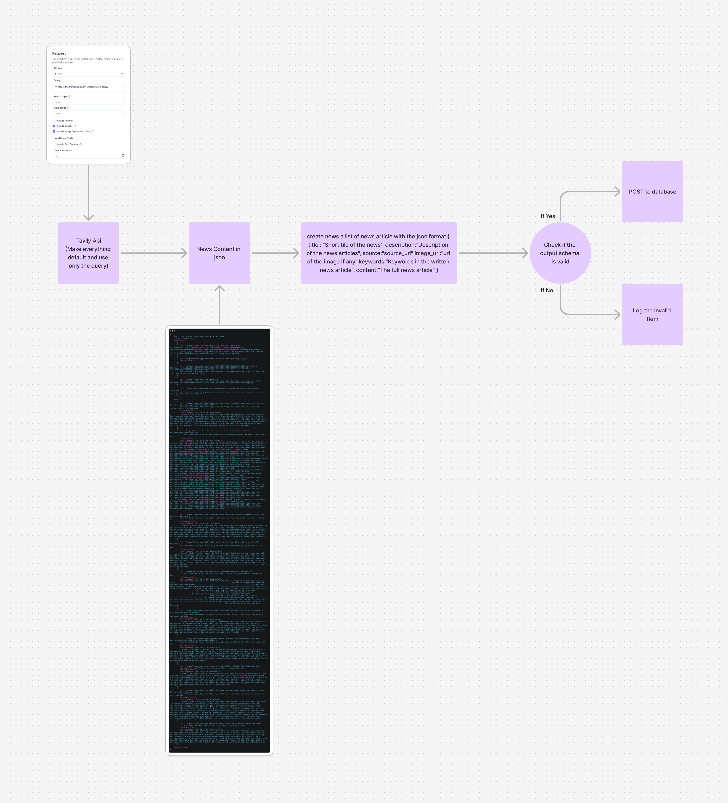
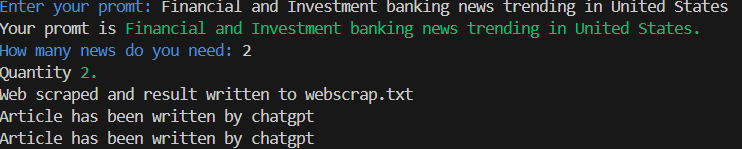

# Tavily OpenAI News Generator

This project integrates the Tavily API with the OpenAI API to generate dynamic and engaging news reports. It fetches data from Tavily and processes it with OpenAI's GPT to create readable, structured news articles.

---

## Table of Contents

- [Overview](#overview)
- [Features](#features)
- [Requirements](#requirements)
- [Installation](#installation)
- [Usage](#usage)
- [Configuration](#configuration)
- [Contributing](#contributing)
- [License](#license)

---

## Overview

The Tavily OpenAI News Generator streamlines the process of creating news reports. By leveraging the Tavily API for data collection and OpenAI for content generation, it simplifies the task of producing high-quality reports.

---

## Features

- **Data Fetching**: Retrieves up-to-date information from the Tavily API.
- **AI-Powered Content Creation**: Utilizes OpenAI GPT to craft well-written reports.
- **Customizable Output**: Allows you to tailor the tone, length, and style of reports.
- **User-Friendly**: Easy-to-use command-line interface for generating reports.

---

## Requirements

- Python 3.8 or higher
- Tavily API key
- OpenAI API key

---

## Architecture


## Installation

1. Clone the repository:
   ```bash
   git clone https://github.com/programmers-union/news-genai.git
   cd news-genai
   ```

2. Create and activate a virtual environment:
   ```bash
   python -m venv venv
   source venv/bin/activate  # Windows: venv\Scripts\activate
   ```

3. Install dependencies:
   ```bash
   pip install -r requirements.txt
   ```

---

## Usage

1. Configure API keys in a `.env` file in the root directory:
   ```env
   TAVILY_API_KEY=your_tavily_api_key
   OPENAI_API_KEY=your_openai_api_key
   ```

2. Run the script:
   ```bash
   python generate.py
   ```

3. Follow prompts to generate your news report.
   

---

## Configuration

- API keys are loaded from the `.env` file.
- Generated reports are saved in the root directory by default.

---

## Contributing

1. Fork the repository.
2. Create a feature branch:
   ```bash
   git checkout -b feature-name
   ```
3. Commit your changes:
   ```bash
   git commit -m "Add feature-name"
   ```
4. Push to your fork:
   ```bash
   git push origin feature-name
   ```
5. Open a pull request.

---

## License

This project is licensed under the MIT License. See the `LICENSE` file for details.

